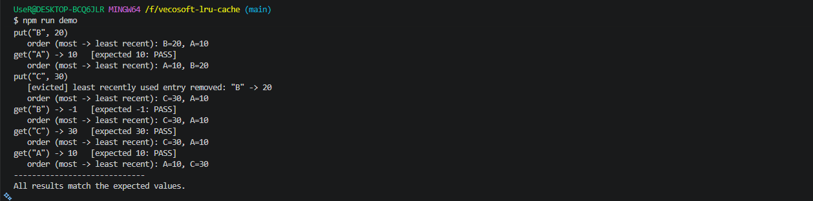
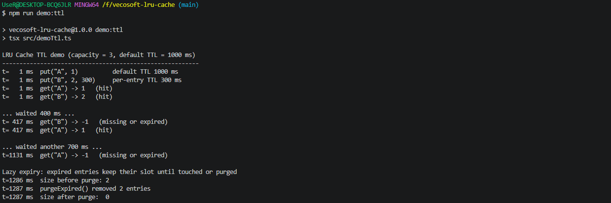

# LRU Cache

A Least Recently Used (LRU) cache in TypeScript with **O(1) average `get` and `put`**, optional **TTL expiration**, and an eviction callback. It has no runtime dependencies.

## Features

- `get(key)` returns the value, or `-1` if the key is missing or expired
- `put(key, value)` inserts or updates an entry and evicts the least recently used one when over capacity
- Optional TTL: a cache-wide default plus a per-entry override
- `onEvict` callback fired when an entry is evicted for capacity
- Injectable clock (`now`), so TTL tests run without real waiting
- Input validation for capacity and TTL (throws `RangeError`)

## How it works

Two structures work together:

| Structure | Purpose |
| --- | --- |
| `Map<K, ListNode>` | Finds an entry by key in O(1) |
| Doubly linked list | Orders entries from most to least recently used |

- A `get` hit moves the node to the front of the list.
- A `put` adds a node at the front. If the cache is over capacity, the node at the back (the least recently used) is removed.
- `head` and `tail` are sentinel nodes, so inserting and removing never needs special cases for an empty list.
- Because each node stores its neighbours, unlinking and moving a node is O(1) and never requires a search.

### TTL design

Each entry stores an `expiresAt` timestamp. Expiry is **lazy**: an expired entry is removed when it is next read, so `get` and `put` stay O(1) and no timers or background threads are needed. `purgeExpired()` sweeps all expired entries on demand in O(n).

- `put` (re)starts the entry's TTL.
- `get` does not extend the TTL (no sliding expiration).
- An expired entry keeps its slot until it is read, evicted or purged, so `size` can include expired entries.

## Getting started

```bash
git clone https://github.com/mmahadi-ahmedd/vecosoft-lru-cache.git
cd vecosoft-lru-cache
npm install
```

## Usage

```ts
import { LRUCache } from './src/LRUCache'

const cache = new LRUCache<string, number>(2)

cache.put('A', 10)
cache.put('B', 20)
cache.get('A') // 10
cache.put('C', 30) // evicts "B"
cache.get('B') // -1
```

With TTL and an eviction callback:

```ts
const cache = new LRUCache<string, number>(3, {
  ttlMs: 1000,
  onEvict: (key, value) => console.log(`evicted ${key}=${value}`),
})

cache.put('A', 1) // expires in 1000 ms
cache.put('B', 2, 300) // per-entry TTL of 300 ms
cache.purgeExpired() // manually remove expired entries
```

## Scripts

| Command | Description |
| --- | --- |
| `npm test` | Run the test suite (16 tests) |
| `npm run typecheck` | Type-check without emitting files |
| `npm run demo` | Print a trace of the task's example |
| `npm run demo:ttl` | Print a trace of TTL expiry, refresh and purge |

## Demo output

### Core LRU behaviour



### TTL behaviour



## Complexity

| Operation | Time | Space |
| --- | --- | --- |
| `get` | O(1) average | O(1) |
| `put` | O(1) average | O(1) |
| `purgeExpired` | O(n) | O(n) |
| `entries` | O(n) | O(n) |

Total space is O(capacity).

## Design decisions and trade-offs

- **Map plus doubly linked list.** A Map alone cannot reorder in O(1), and a list alone cannot look up by key in O(1). Together they can do both.
- **Sentinel head and tail.** These remove null checks and edge cases when the list is empty or has one item.
- **Lazy expiry over a background timer.** This keeps operations O(1), avoids keeping the process alive, and makes behaviour deterministic. The trade-off is that memory is freed later.
- **Injectable clock.** Tests use a fake clock, so they are fast and never flaky.
- **`-1` for a miss.** This follows the task's specification. In a general-purpose library I would return `undefined` instead, so that `-1` can be stored as a value.

## Known limitations

- Not thread-safe (JavaScript is single-threaded, so this only matters with workers).
- `purgeExpired()` is manual. It is not scheduled automatically.
- Expiry does not trigger `onEvict`, which only fires for capacity evictions.

## Project structure

```
src/
  ListNode.ts     doubly linked list node
  LRUCache.ts     cache implementation
  demo.ts         LRU trace demo
  demoTtl.ts      TTL trace demo
tests/
  LRUCache.test.ts
docs/
  screenshots/    demo output screenshots
```
